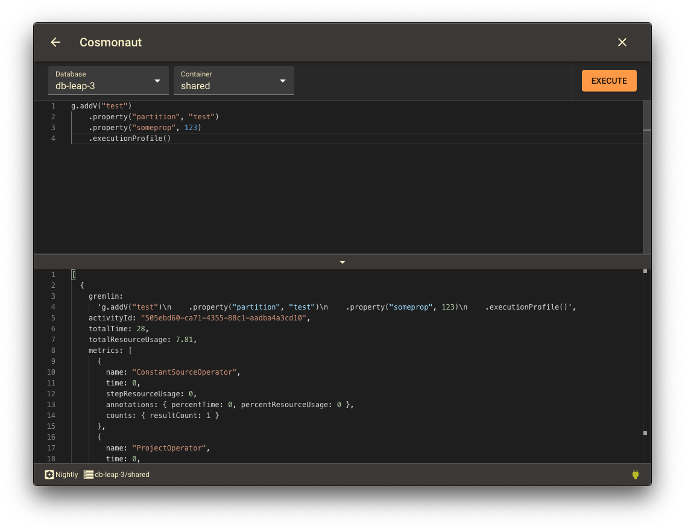

# Cosmonaut
Cosmonaut is an Electron application for querying [Azure Cosmos](https://docs.microsoft.com/en-us/azure/cosmos-db/graph-introduction) databases using [Gremlin graph traversal language](http://tinkerpop.apache.org/docs/current/reference/).

## About
[Azure Cosmos Emulator](https://docs.microsoft.com/en-us/azure/cosmos-db/local-emulator) does not ship with any sort of client for querying with Gremlin, and Azure Portal only has a single line input for queries, while also being clunky to use when switching databases and collections. Cosmonaut aims to work around these issues and make working with these databases faster and simpler.

The application features connection profiles that allow for easy connecting to and switching between various databases, be they hosted in Azure or by Cosmos Emulator.

 

When connected to a profile, queries are written in Monaco Editor, and output is shown as formatted JSON.

## Installation

Run ``yarn`` to download the dependencies, ``yarn build`` to build the project and ``yarn electron`` to start the application.
